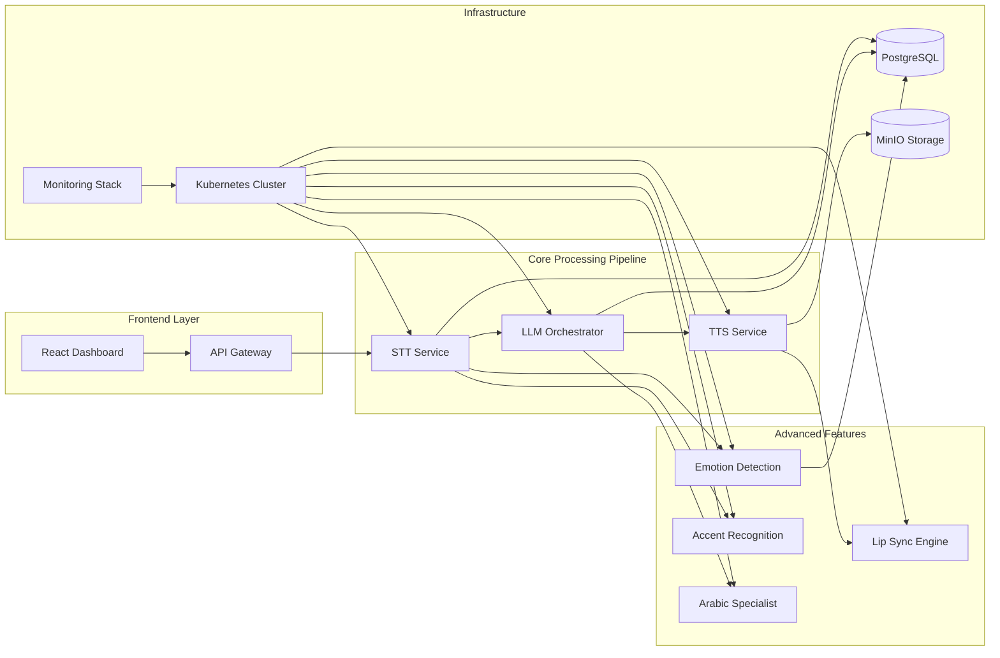
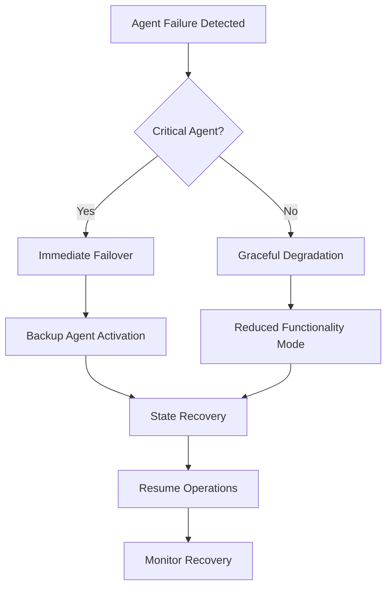
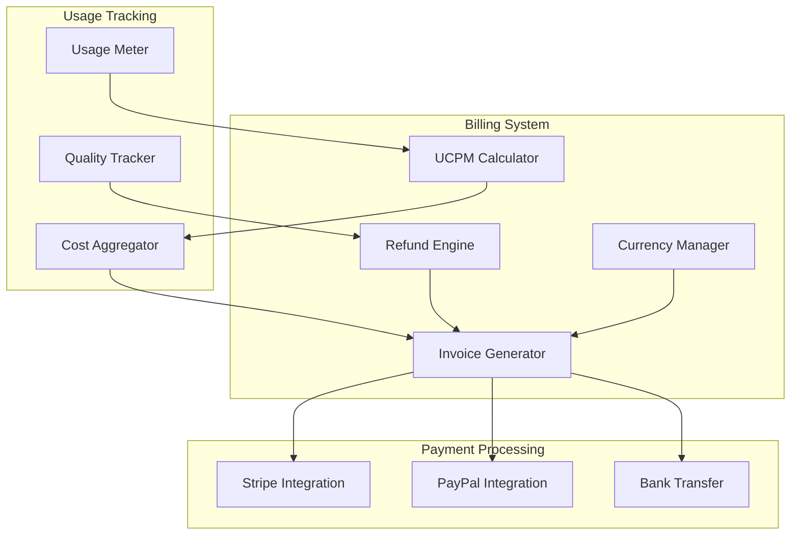
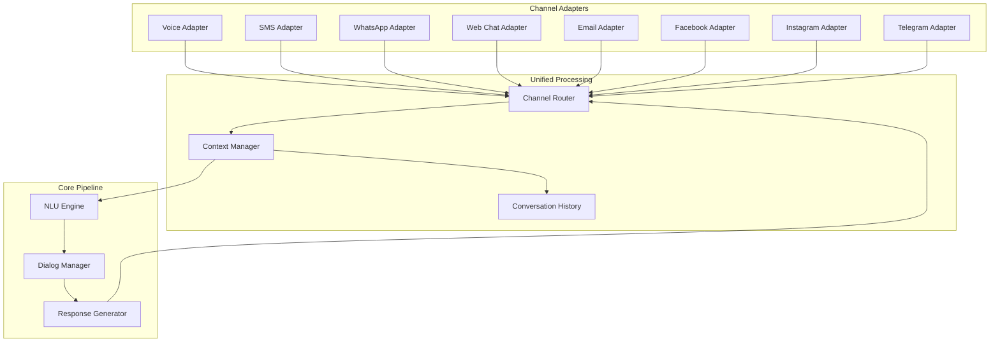
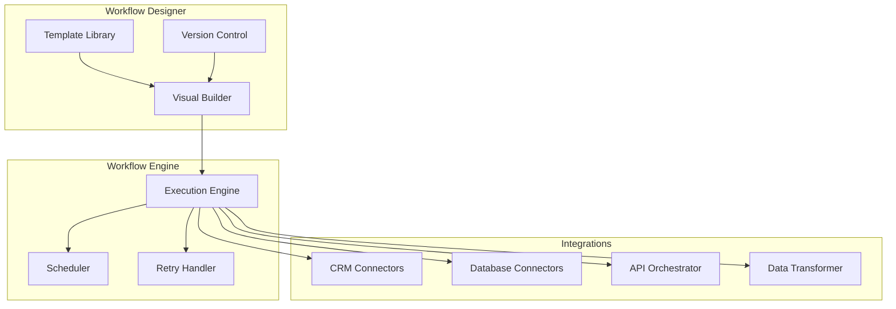
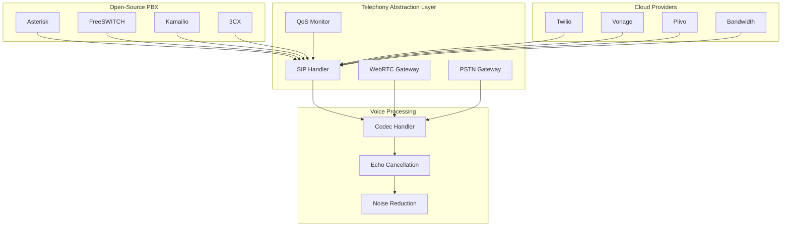
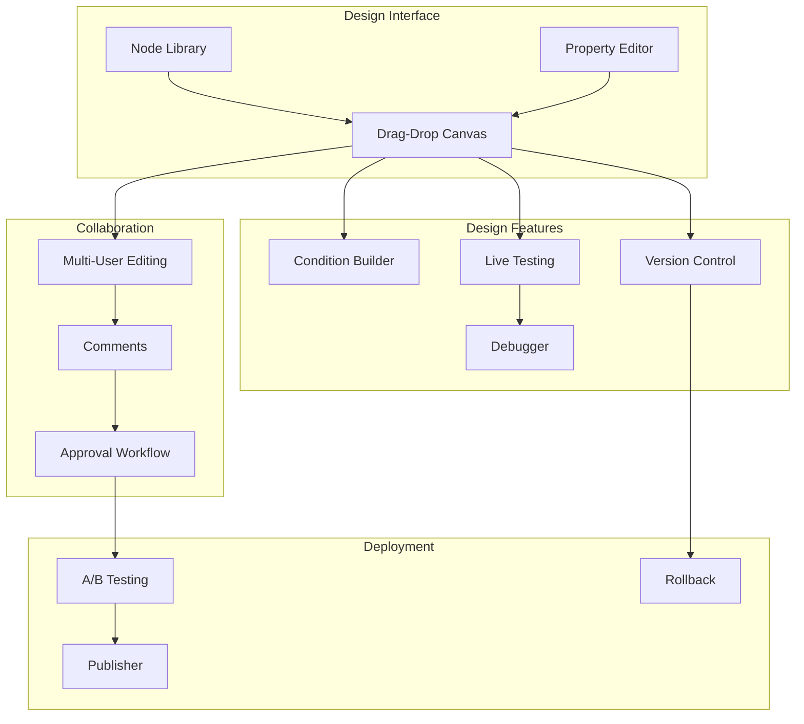
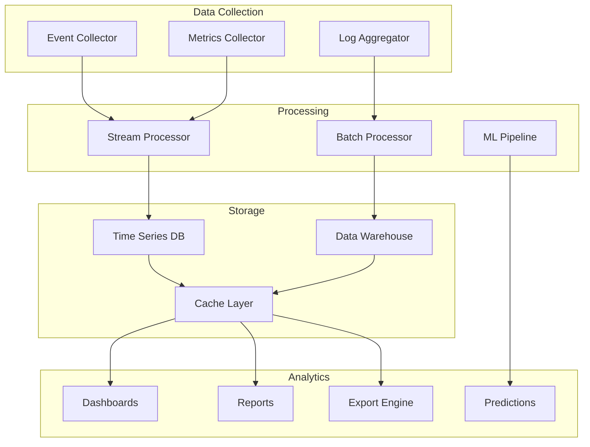

# Design Document

## Overview

The EUVoice AI platform will be developed using a sophisticated multi-agent architecture where specialized AI agents coordinate to build, deploy, and maintain different components of the voice assistant platform. This design leverages frameworks like CrewAI, AutoGen, or similar multi-agent orchestration systems to enable parallel development while ensuring seamless integration and compliance with EU regulations.

The system architecture follows a microservices pattern deployed on Kubernetes in EU clouds, with each component developed and maintained by dedicated agent teams. The core pipeline processes: Audio Input → STT → LLM Processing → TTS → Output, with additional agents handling emotion detection, lip sync, accent recognition, and system optimization.

## Architecture

### Multi-Agent Orchestration Layer

```mermaid
graph TB
    subgraph "Agent Orchestration Layer"
        AO[Agent Orchestrator]
        KB[Shared Knowledge Base]
        CC[Coordination Controller]
        QM[Quality Monitor]
    end
    
    subgraph "Core Development Agents"
        SA[STT Agent]
        LA[LLM Agent] 
        TA[TTS Agent]
        OA[Orchestrator Agent]
    end
    
    subgraph "Specialized Feature Agents"
        EA[Emotion Agent]
        AA[Accent Agent]
        LSA[Lip Sync Agent]
        ARA[Arabic Agent]
    end
    
    subgraph "Infrastructure Agents"
        FA[Frontend Agent]
        IA[Infrastructure Agent]
        INA[Integration Agent]
        DA[Dataset Agent]
    end
    
    subgraph "Quality & Compliance Agents"
        CA[Compliance Agent]
        PA[Performance Agent]
        SA2[Security Agent]
        OPT[Optimization Agent]
    end
    
    AO --> SA
    AO --> LA
    AO --> TA
    AO --> OA
    AO --> EA
    AO --> AA
    AO --> LSA
    AO --> ARA
    AO --> FA
    AO --> IA
    AO --> INA
    AO --> DA
    AO --> CA
    AO --> PA
    AO --> SA2
    AO --> OPT
    
    KB <--> AO
    CC <--> AO
    QM <--> AO
```



### System Architecture



## Components and Interfaces

### Agent Communication Protocol

All agents communicate through a standardized protocol based on OpenAI function calling patterns:

```python
class AgentMessage:
    agent_id: str
    task_id: str
    message_type: str  # "request", "response", "notification", "error"
    payload: Dict[str, Any]
    dependencies: List[str]
    priority: int
    timestamp: datetime
```

### Core Development Agents

#### STT Agent
- **Responsibility**: Speech-to-Text implementation using Mistral Voxtral models
- **Technologies**: Mistral Voxtral Small (24B), Voxtral Mini (3B), NVIDIA Canary-1b-v2
- **Interfaces**: 
  - Audio input processing
  - Real-time transcription streaming
  - Language detection
  - Integration with Accent Agent for improved accuracy

#### LLM Agent
- **Responsibility**: Dialog management, reasoning, and tool calling
- **Technologies**: Mistral Small 3.1 (22B), TildeOpen LLM (30B)
- **Interfaces**:
  - Context management
  - Intent recognition
  - Response generation
  - Tool calling coordination

#### TTS Agent
- **Responsibility**: Text-to-Speech synthesis with EU accent support
- **Technologies**: XTTS-v2, MeloTTS, NVIDIA Parakeet-tdt-0.6b-v3
- **Interfaces**:
  - Multi-language synthesis
  - Voice cloning
  - Emotion-aware speech generation
  - Real-time streaming output

#### Orchestrator Agent
- **Responsibility**: Flow coordination, interruptions, and service handoffs
- **Technologies**: Custom LangChain-like framework using Haystack
- **Interfaces**:
  - Pipeline management
  - Context switching
  - Error handling and recovery
  - Performance monitoring

### Specialized Feature Agents

#### Emotion Agent
- **Responsibility**: Real-time emotion detection and sentiment analysis
- **Technologies**: Custom emotion recognition models, sentiment analysis pipelines
- **Interfaces**:
  - Audio emotion detection (>85% accuracy)
  - Text sentiment scoring (-1 to +1)
  - Emotional context for TTS modulation
  - Customer experience metrics

#### Accent Agent
- **Responsibility**: Regional accent detection and adaptation
- **Technologies**: Accent classification models, regional acoustic models
- **Interfaces**:
  - Real-time accent identification (>90% accuracy)
  - STT model selection based on accent
  - Regional pronunciation adaptation
  - Cultural context awareness

#### Lip Sync Agent
- **Responsibility**: Facial animation synchronization with synthesized speech
- **Technologies**: 3D facial animation engines, phoneme-to-viseme mapping
- **Interfaces**:
  - Real-time lip sync generation (<50ms latency)
  - Multiple avatar style support
  - 3D rendering engine compatibility
  - Video output streaming

#### Arabic Agent
- **Responsibility**: Specialized Arabic language processing and cultural adaptation
- **Technologies**: Arabic-specific models, dialect recognition, cultural context engines
- **Interfaces**:
  - MSA and dialect support (Egyptian, Levantine, Gulf, Maghrebi)
  - Diacritization and cultural context
  - Code-switching handling
  - Regional accent synthesis (>4.2 MOS)

### Infrastructure Agents

#### Frontend Agent
- **Responsibility**: React-based no-code dashboard development
- **Technologies**: React, TypeScript, Material-UI, WebSocket integration
- **Interfaces**:
  - User interface components
  - Real-time audio streaming
  - Configuration management
  - Analytics dashboards

#### Infrastructure Agent
- **Responsibility**: Kubernetes deployment, monitoring, and EU cloud integration
- **Technologies**: Kubernetes, Helm, Prometheus, Grafana, EU cloud providers
- **Interfaces**:
  - Container orchestration
  - Auto-scaling configuration
  - Monitoring and alerting
  - EU compliance enforcement

#### Integration Agent
- **Responsibility**: APIs, webhooks, and third-party integrations
- **Technologies**: FastAPI, REST/GraphQL, WebSocket, OAuth2
- **Interfaces**:
  - External API integrations
  - Webhook management
  - Authentication and authorization
  - Rate limiting and security

#### Dataset Agent
- **Responsibility**: Data curation, validation, and training pipeline management
- **Technologies**: PyTorch, Hugging Face, NeMo Toolkit, data validation frameworks
- **Interfaces**:
  - Dataset discovery and validation
  - Training data preparation
  - Model fine-tuning coordination
  - Performance evaluation

### Quality & Compliance Agents

#### Compliance Agent
- **Responsibility**: GDPR, AI Act, and licensing compliance enforcement
- **Technologies**: Automated compliance checking, privacy-preserving techniques
- **Interfaces**:
  - Code compliance validation
  - Data anonymization
  - License verification
  - Audit trail generation

#### Performance Agent
- **Responsibility**: System performance monitoring and optimization
- **Technologies**: Performance profiling tools, latency monitoring, resource optimization
- **Interfaces**:
  - Real-time performance metrics
  - Bottleneck identification
  - Resource allocation optimization
  - SLA monitoring

## Data Models

### Agent State Management

```python
class AgentState:
    agent_id: str
    status: AgentStatus  # IDLE, WORKING, BLOCKED, ERROR
    current_task: Optional[Task]
    dependencies: List[str]
    capabilities: List[str]
    performance_metrics: Dict[str, float]
    last_updated: datetime

class Task:
    task_id: str
    description: str
    requirements: List[str]
    dependencies: List[str]
    assigned_agent: str
    status: TaskStatus  # PENDING, IN_PROGRESS, COMPLETED, FAILED
    priority: int
    estimated_duration: timedelta
    actual_duration: Optional[timedelta]
```

### Communication Models

```python
class AgentCoordination:
    coordination_id: str
    participating_agents: List[str]
    shared_context: Dict[str, Any]
    synchronization_points: List[SyncPoint]
    conflict_resolution: ConflictResolution

class SyncPoint:
    sync_id: str
    required_agents: List[str]
    completion_criteria: Dict[str, Any]
    timeout: timedelta
```

### Voice Processing Models

```python
class AudioProcessingPipeline:
    session_id: str
    input_audio: AudioStream
    stt_result: TranscriptionResult
    llm_response: LLMResponse
    tts_output: AudioStream
    emotion_data: EmotionAnalysis
    accent_info: AccentDetection
    lip_sync_data: Optional[LipSyncAnimation]

class TranscriptionResult:
    text: str
    confidence: float
    language: str
    dialect: Optional[str]
    timestamps: List[Tuple[float, float]]
    emotion_markers: List[EmotionMarker]
```

## Error Handling

### Agent Failure Recovery



### Error Handling Strategies

1. **Circuit Breaker Pattern**: Prevent cascading failures between agents
2. **Retry with Exponential Backoff**: Handle transient failures
3. **Graceful Degradation**: Maintain core functionality when specialized agents fail
4. **State Persistence**: Ensure agent state can be recovered after failures
5. **Health Checks**: Continuous monitoring of agent health and performance

## Testing Strategy

### Multi-Agent Testing Framework

```python
class AgentTestSuite:
    def test_agent_communication(self):
        """Test inter-agent message passing and coordination"""
        pass
    
    def test_parallel_execution(self):
        """Test multiple agents working simultaneously without conflicts"""
        pass
    
    def test_failure_recovery(self):
        """Test system behavior when agents fail"""
        pass
    
    def test_performance_under_load(self):
        """Test system performance with multiple concurrent tasks"""
        pass
```

### Testing Levels

1. **Unit Testing**: Individual agent functionality
2. **Integration Testing**: Agent-to-agent communication
3. **System Testing**: End-to-end pipeline testing
4. **Performance Testing**: Latency and throughput validation
5. **Compliance Testing**: GDPR and AI Act compliance verification
6. **Chaos Testing**: Failure scenario simulation

### Continuous Integration for Multi-Agent Systems

```yaml
# CI Pipeline for Multi-Agent Development
stages:
  - agent_unit_tests
  - agent_integration_tests
  - system_integration_tests
  - performance_validation
  - compliance_checks
  - deployment_staging
  - production_deployment

agent_coordination_tests:
  - Test agent discovery and registration
  - Test task distribution and load balancing
  - Test conflict resolution mechanisms
  - Test synchronization points
```

## Hardware Requirements

### Development Environment

#### Minimum Requirements (MVP Development)
- **CPU**: 32-core AMD EPYC or Intel Xeon (for parallel agent development)
- **RAM**: 128GB DDR4 (multiple agents running simultaneously)
- **GPU**: 4x NVIDIA RTX 4090 or 2x NVIDIA A100 40GB (model training/inference)
- **Storage**: 10TB NVMe SSD (datasets, models, code repositories)
- **Network**: 10Gbps Ethernet (agent communication, data transfer)

#### Recommended Development Setup
- **CPU**: 64-core AMD EPYC 9654 or Intel Xeon Platinum 8480+
- **RAM**: 256GB DDR5 ECC
- **GPU**: 4x NVIDIA H100 80GB or 8x NVIDIA A100 80GB
- **Storage**: 50TB NVMe SSD array with RAID 10
- **Network**: 25Gbps Ethernet with redundancy

### Production Environment (EU Hosting)

#### Core Processing Cluster
```yaml
Node Configuration:
  STT/LLM Nodes:
    - CPU: 2x AMD EPYC 9654 (96 cores total)
    - RAM: 512GB DDR5 ECC
    - GPU: 8x NVIDIA H100 80GB NVLink
    - Storage: 20TB NVMe SSD
    - Network: 100Gbps InfiniBand
    - Quantity: 10-20 nodes

  TTS/Audio Processing Nodes:
    - CPU: 2x Intel Xeon Platinum 8480+ (112 cores total)
    - RAM: 256GB DDR5 ECC
    - GPU: 4x NVIDIA A100 80GB
    - Storage: 10TB NVMe SSD
    - Network: 50Gbps Ethernet
    - Quantity: 5-10 nodes

  Agent Orchestration Nodes:
    - CPU: 2x AMD EPYC 9554 (64 cores total)
    - RAM: 128GB DDR5 ECC
    - GPU: 2x NVIDIA RTX 6000 Ada (for light inference)
    - Storage: 5TB NVMe SSD
    - Network: 25Gbps Ethernet
    - Quantity: 3-5 nodes
```

#### Storage Infrastructure
- **Primary Storage**: 500TB distributed storage (Ceph/GlusterFS)
- **Model Storage**: 100TB high-speed NVMe for model weights
- **Dataset Storage**: 1PB object storage (MinIO) for training data
- **Backup Storage**: 2PB tape/cold storage for compliance

#### Network Infrastructure
- **Internal**: 100Gbps InfiniBand fabric for GPU-to-GPU communication
- **External**: Multiple 100Gbps connections to EU internet exchanges
- **CDN**: EU-based CDN for low-latency audio streaming
- **Redundancy**: Multi-path networking with automatic failover

### Scaling Projections

#### User Load Capacity
```yaml
Concurrent Users:
  Development Setup: 100-500 users
  Small Production: 1,000-5,000 users
  Medium Production: 10,000-50,000 users
  Large Production: 100,000+ users

Resource Scaling:
  Per 1,000 concurrent users:
    - CPU: 8-16 cores
    - RAM: 32-64GB
    - GPU: 0.5-1 A100 equivalent
    - Storage: 1-2TB
    - Bandwidth: 1-5Gbps
```

#### Geographic Distribution (EU Compliance)
- **Primary DC**: Frankfurt, Germany (OVHcloud/Scaleway)
- **Secondary DC**: Amsterdam, Netherlands (backup/DR)
- **Edge Locations**: Paris, Milan, Stockholm, Warsaw
- **Compliance**: All hardware within EU/EEA boundaries

### Cost Estimates

#### Development Phase (6-12 months)
- **Hardware**: €500K - €1M (purchase/lease)
- **Cloud Resources**: €50K - €100K/month
- **EU Supercomputing**: €100K - €300K (EuroHPC allocation)

#### Production Phase (Annual)
- **Infrastructure**: €2M - €5M/year
- **Bandwidth**: €500K - €1M/year
- **Compliance/Auditing**: €200K - €500K/year

### Energy and Sustainability

#### Power Requirements
- **Development**: 50-100kW continuous
- **Production**: 500kW - 2MW continuous
- **Cooling**: Additional 30-50% of compute power

#### Green Computing Initiatives
- **Renewable Energy**: 100% renewable energy sources
- **Efficient Hardware**: Latest generation GPUs with better performance/watt
- **Dynamic Scaling**: Auto-scaling to minimize idle resource consumption
- **Heat Recovery**: Waste heat utilization for building heating

### EU-Specific Considerations

#### Compliance Hardware
- **HSM Modules**: Hardware Security Modules for encryption key management
- **Audit Logging**: Dedicated hardware for immutable audit trails
- **Data Residency**: Geographically distributed storage within EU

#### Vendor Requirements
- **Primary Vendors**: EU-based or EU-compliant suppliers
- **Hardware Sourcing**: Preference for European manufacturers
- **Support**: 24/7 EU-based technical support
- **Certifications**: Common Criteria, FIPS 140-2 Level 3+ compliance

### Open-Source and Low-Cost Alternatives

#### For Teams Without Dedicated Hardware

##### Free/Open-Source Computing Resources

**EuroHPC Access (EU-Funded)**
- **LUMI Supercomputer** (Finland): Free access for research projects
- **Mare Nostrum** (Spain): Academic and research allocations
- **Meluxina** (Luxembourg): EU-based GPU clusters
- **Application Process**: Submit research proposal for free compute time
- **Allocation**: Up to millions of GPU hours for qualifying projects

**Google Colab Pro/Pro+ (EU Regions)**
- **Cost**: €10-50/month per user
- **Resources**: A100/V100 GPUs, up to 51GB RAM
- **Limitations**: Session timeouts, usage quotas
- **EU Compliance**: Select EU regions for data processing

**Kaggle Notebooks (Free Tier)**
- **Cost**: Free with limitations
- **Resources**: P100/T4 GPUs, 30 hours/week
- **Datasets**: Access to large open datasets
- **Community**: Collaborative development environment

**Paperspace Gradient**
- **Cost**: €0.45-2.30/hour for GPU instances
- **Resources**: RTX 4000 to A100 options
- **EU Hosting**: Available in EU regions
- **Jupyter Integration**: Easy notebook-based development

##### Open-Source Model Hosting

**Hugging Face Spaces (Free/Pro)**
- **Free Tier**: CPU-only, limited resources
- **Pro Tier**: €20/month, GPU access
- **Model Hub**: Pre-trained models available
- **Community**: Collaborative model development

**Replicate (Pay-per-use)**
- **Pricing**: €0.0002-0.023 per second
- **Models**: Pre-deployed open-source models
- **API Access**: Simple REST API integration
- **Scaling**: Automatic scaling based on demand

**RunPod (GPU Cloud)**
- **Cost**: €0.20-1.50/hour for various GPUs
- **EU Regions**: Available in European data centers
- **Templates**: Pre-configured environments
- **Spot Instances**: Up to 80% cost savings

##### Development Environment Alternatives

**GitHub Codespaces**
- **Cost**: Free tier + €0.18/hour for premium
- **Resources**: Up to 32-core, 64GB RAM instances
- **Integration**: Direct GitHub integration
- **EU Hosting**: Available in EU regions

**Gitpod**
- **Cost**: Free tier + €9-25/month
- **Resources**: Up to 16-core instances
- **EU Compliance**: EU-based infrastructure
- **VS Code**: Browser-based development

**Replit (Team/Enterprise)**
- **Cost**: €7-20/month per user
- **Collaboration**: Real-time collaborative coding
- **Deployment**: Integrated hosting platform
- **Community**: Large developer community

#### Hybrid Development Strategy

##### Phase 1: Proof of Concept (€0-500/month)
```yaml
Resources:
  - Google Colab Pro: €50/month
  - Hugging Face Pro: €20/month
  - GitHub Codespaces: €100/month
  - Small EU VPS: €50/month
  
Capabilities:
  - Model experimentation
  - Basic agent development
  - Small-scale testing
  - Community collaboration
```

##### Phase 2: MVP Development (€500-2000/month)
```yaml
Resources:
  - Paperspace Gradient: €500/month
  - RunPod GPU instances: €800/month
  - EU cloud storage: €200/month
  - Monitoring tools: €100/month
  
Capabilities:
  - Multi-agent development
  - Model fine-tuning
  - Integration testing
  - Small user base support
```

##### Phase 3: Production Ready (€2000-10000/month)
```yaml
Resources:
  - EU cloud infrastructure: €5000/month
  - GPU compute clusters: €3000/month
  - Storage and bandwidth: €1000/month
  - Monitoring and compliance: €500/month
  
Capabilities:
  - Full production deployment
  - Thousands of concurrent users
  - Complete compliance suite
  - 24/7 operations
```

#### Community and Grant Opportunities

**EU Funding Programs**
- **Horizon Europe**: Up to €2.5M for AI research projects
- **Digital Europe Programme**: €56M AI fund for startups
- **EuroHPC JU**: Free supercomputing access for research
- **Regional Funds**: National and regional AI development grants

**Open-Source Communities**
- **Hugging Face**: Model sharing and collaboration
- **Papers with Code**: Research implementation community
- **Mozilla Common Voice**: Crowdsourced dataset contribution
- **OpenEuroLLM**: EU-specific language model development

**Academic Partnerships**
- **University Collaborations**: Access to research computing
- **Student Projects**: Leverage academic resources
- **Research Grants**: Joint academic-industry projects
- **Internship Programs**: Access to student developers

#### Cost-Effective Development Approach

**Distributed Development Model**
- **Agent Specialization**: Different teams work on different agents
- **Resource Sharing**: Shared GPU time across development teams
- **Incremental Scaling**: Start small, scale based on success
- **Community Contributions**: Leverage open-source community

**Technical Optimizations**
- **Model Quantization**: Reduce memory requirements by 50-75%
- **Efficient Architectures**: Use smaller, optimized models
- **Edge Computing**: Distribute processing to reduce central costs
- **Caching Strategies**: Minimize redundant computations

## Implementation Considerations

### Agent Development Workflow

1. **Agent Specification**: Define agent capabilities, interfaces, and dependencies
2. **Parallel Development**: Multiple agents developed simultaneously by different teams
3. **Interface Contracts**: Strict adherence to communication protocols
4. **Continuous Integration**: Automated testing of agent interactions
5. **Staged Deployment**: Gradual rollout of new agent capabilities

### Performance Optimization

- **Load Balancing**: Distribute tasks across multiple instances of the same agent type
- **Caching**: Shared cache for frequently accessed data between agents
- **Asynchronous Processing**: Non-blocking communication between agents
- **Resource Pooling**: Efficient GPU/CPU resource sharing among agents

### Security and Compliance

- **Agent Authentication**: Secure communication between agents
- **Data Encryption**: End-to-end encryption for sensitive data
- **Audit Logging**: Comprehensive logging of all agent activities
- **Privacy Preservation**: Built-in anonymization and consent management

## E
xtended Architecture for Requirements 13-22

### Billing and Monetization System (Requirement 13)

#### Billing Service Architecture



#### Billing Service Components

**UCPM Calculator:**
- Bundles STT, LLM, TTS, and telephony costs
- Real-time cost calculation
- Per-minute pricing model
- Volume discounts
- Regional pricing adjustments

**Currency Manager:**
- Multi-currency support (EUR, AED, INR, SGD, JPY, USD)
- Real-time exchange rates (ECB, Fed APIs)
- 30-day advance notice for rate changes
- Historical rate tracking

**Refund Engine:**
- Automatic quality-based refunds
- LLM hallucination detection
- Timeout/error tracking
- 24-hour processing
- Detailed refund reports

**Data Models:**

```python
class BillingAccount:
    account_id: str
    currency: str  # EUR, AED, INR, SGD, JPY
    ucpm_rate: Decimal
    volume_tier: str
    payment_method: str
    
class UsageRecord:
    session_id: str
    duration_seconds: int
    stt_cost: Decimal
    llm_cost: Decimal
    tts_cost: Decimal
    telephony_cost: Decimal
    total_ucpm: Decimal
    quality_score: float
    refund_applied: bool
    
class Invoice:
    invoice_id: str
    account_id: str
    period_start: datetime
    period_end: datetime
    total_minutes: int
    total_cost: Decimal
    currency: str
    line_items: List[LineItem]
    refunds: List[Refund]
```

### Omnichannel Communication Platform (Requirement 17)

#### Omnichannel Architecture



#### Channel Adapters

**Voice Adapter:**
- WebRTC, SIP, PSTN
- Real-time audio streaming
- Voice activity detection

**SMS Adapter:**
- Twilio, Vonage, Plivo
- MMS support
- Delivery receipts

**WhatsApp Adapter:**
- WhatsApp Business API
- Rich media support
- Template messages

**Web Chat Adapter:**
- Embeddable JavaScript widget
- Typing indicators
- File uploads
- Proactive triggers

**Email Adapter:**
- SMTP/IMAP integration
- HTML formatting
- Attachment handling

**Social Media Adapters:**
- Facebook Messenger API
- Instagram Direct API
- Telegram Bot API

**Data Models:**

```python
class UnifiedMessage:
    message_id: str
    conversation_id: str
    channel: ChannelType
    direction: str  # inbound/outbound
    content: MessageContent
    metadata: Dict[str, Any]
    timestamp: datetime
    
class ConversationContext:
    conversation_id: str
    user_id: str
    channels_used: List[ChannelType]
    current_channel: ChannelType
    history: List[UnifiedMessage]
    state: Dict[str, Any]
    preferences: UserPreferences
```

### Native Workflow Automation (Requirement 18)

#### Workflow Engine Architecture



#### Workflow Components

**Visual Workflow Builder:**
- Drag-and-drop nodes
- Condition builders
- Loop constructs
- Parallel execution
- Error handling

**Native CRM Connectors:**
- Salesforce (REST/SOAP)
- HubSpot (API v3)
- Microsoft Dynamics (Web API)
- SAP (OData)
- Zoho (REST API)
- Pipedrive (API v1)

**Database Connectors:**
- PostgreSQL
- MySQL
- MongoDB
- Redis
- Elasticsearch

**Workflow Templates:**
- Lead qualification
- Appointment booking
- Order processing
- Customer onboarding
- Support ticket creation
- Payment processing

**Data Models:**

```python
class Workflow:
    workflow_id: str
    name: str
    description: str
    trigger: WorkflowTrigger
    nodes: List[WorkflowNode]
    connections: List[NodeConnection]
    version: int
    
class WorkflowNode:
    node_id: str
    node_type: str  # condition, action, loop, api_call
    config: Dict[str, Any]
    retry_policy: RetryPolicy
    timeout: int
    
class WorkflowExecution:
    execution_id: str
    workflow_id: str
    status: ExecutionStatus
    start_time: datetime
    end_time: Optional[datetime]
    variables: Dict[str, Any]
    execution_log: List[ExecutionStep]
```

### Open Telephony Platform (Requirement 20)

#### Telephony Integration Architecture



#### Telephony Integrations

**Asterisk Integration:**
- AMI (Asterisk Manager Interface)
- AGI (Asterisk Gateway Interface)
- ARI (Asterisk REST Interface)
- Dialplan integration
- Call recording
- Queue management

**FreeSWITCH Integration:**
- ESL (Event Socket Library)
- mod_xml_curl
- mod_lua scripting
- Conference bridges
- Call parking

**3CX Integration:**
- Call Flow Designer API
- SIP trunk configuration
- Extension management
- Call recording API

**Direct SIP:**
- RFC 3261 compliance
- SRTP encryption
- SDP negotiation
- NAT traversal (STUN/TURN)

**WebRTC:**
- Browser-based calling
- STUN/TURN servers
- ICE negotiation
- Adaptive bitrate

**Data Models:**

```python
class TelephonyProvider:
    provider_id: str
    provider_type: str  # asterisk, freeswitch, twilio, sip
    connection_config: Dict[str, Any]
    capabilities: List[str]
    health_status: HealthStatus
    
class CallSession:
    call_id: str
    provider: str
    direction: str  # inbound/outbound
    from_number: str
    to_number: str
    start_time: datetime
    end_time: Optional[datetime]
    duration: int
    qos_metrics: QoSMetrics
    
class QoSMetrics:
    jitter: float  # ms
    packet_loss: float  # percentage
    mos_score: float  # 1-5
    latency: float  # ms
    codec: str
```

### Advanced Visual Conversation Designer (Requirement 21)

#### Conversation Designer Architecture



#### Designer Components

**Node Types:**
- Intent nodes
- Entity extraction
- Response nodes
- Condition nodes
- Action nodes
- Integration nodes
- Loop nodes
- Handoff nodes

**Condition Builder:**
- Visual logic builder
- AND/OR operators
- Variable comparisons
- Regex matching
- Custom functions

**Live Testing:**
- Real-time preview
- Variable inspection
- Step-by-step execution
- Conversation simulation

**A/B Testing:**
- Traffic splitting
- Performance comparison
- Automatic winner selection
- Statistical significance

**Data Models:**

```python
class ConversationFlow:
    flow_id: str
    name: str
    description: str
    version: int
    nodes: List[FlowNode]
    connections: List[NodeConnection]
    variables: Dict[str, VariableDefinition]
    
class FlowNode:
    node_id: str
    node_type: NodeType
    position: Position
    config: NodeConfig
    conditions: List[Condition]
    
class ABTest:
    test_id: str
    flow_id: str
    variants: List[FlowVariant]
    traffic_split: Dict[str, float]
    metrics: TestMetrics
    winner: Optional[str]
```

### Comprehensive Analytics & BI (Requirement 22)

#### Analytics Architecture



#### Analytics Components

**Conversation Analytics:**
- Volume trends
- Completion rates
- Average duration
- User satisfaction (CSAT)
- Intent recognition accuracy
- Entity extraction accuracy

**Customer Journey Analysis:**
- Multi-channel journeys
- Drop-off points
- Conversion funnels
- Path analysis
- Cohort analysis

**Sentiment Analysis:**
- Real-time sentiment tracking
- Sentiment trends
- Drill-down by segment
- Topic-based sentiment
- Agent performance impact

**Business Outcome Tracking:**
- Custom KPIs
- Sales conversions
- Appointment bookings
- Issue resolutions
- Revenue attribution

**Predictive Analytics:**
- Churn prediction
- Success probability
- Optimal intervention points
- Capacity forecasting
- Anomaly detection

**Data Models:**

```python
class ConversationAnalytics:
    conversation_id: str
    start_time: datetime
    end_time: datetime
    duration: int
    channel: str
    outcome: str
    satisfaction_score: float
    sentiment_score: float
    intents_detected: List[str]
    entities_extracted: Dict[str, Any]
    
class CustomerJourney:
    user_id: str
    journey_id: str
    touchpoints: List[Touchpoint]
    channels_used: List[str]
    conversion_events: List[ConversionEvent]
    total_value: Decimal
    
class PredictiveInsight:
    insight_id: str
    insight_type: str  # churn, success, intervention
    user_id: str
    probability: float
    factors: List[Factor]
    recommended_action: str
```

## Implementation Considerations for New Requirements

### Performance Optimization

**Billing System:**
- Asynchronous usage tracking
- Batch invoice generation
- Cached exchange rates
- Optimized cost calculations

**Omnichannel:**
- Connection pooling per channel
- Message queue for high volume
- Channel-specific rate limiting
- Efficient context retrieval

**Workflow Engine:**
- Parallel node execution
- Lazy loading of integrations
- Workflow caching
- Optimized retry logic

**Telephony:**
- Media server clustering
- Codec optimization
- Jitter buffer tuning
- Connection reuse

**Analytics:**
- Real-time stream processing
- Pre-aggregated metrics
- Materialized views
- Query result caching

### Security Considerations

**Billing:**
- PCI DSS compliance
- Encrypted payment data
- Audit logging
- Fraud detection

**Omnichannel:**
- Channel authentication
- Message encryption
- Rate limiting per channel
- Spam detection

**Workflow:**
- Credential encryption
- API key rotation
- Execution sandboxing
- Access control

**Telephony:**
- SRTP encryption
- SIP authentication
- Call recording consent
- Number validation

**Analytics:**
- Data anonymization
- Access control
- Export restrictions
- GDPR compliance

### Scalability Considerations

**Billing:**
- Horizontal scaling of usage meters
- Distributed invoice generation
- Sharded billing database
- Async payment processing

**Omnichannel:**
- Channel adapter clustering
- Message queue partitioning
- Context cache distribution
- Load balancing per channel

**Workflow:**
- Distributed execution engine
- Workflow queue partitioning
- Integration connection pooling
- Stateless execution

**Telephony:**
- Media server clustering
- SIP proxy load balancing
- Geographic distribution
- Capacity-based routing

**Analytics:**
- Time-series database sharding
- Data warehouse partitioning
- Query result caching
- Distributed processing

## Testing Strategy for New Requirements

### Billing System Testing

**Unit Tests:**
- UCPM calculation accuracy
- Currency conversion
- Refund logic
- Invoice generation

**Integration Tests:**
- Payment gateway integration
- Usage tracking accuracy
- Multi-currency handling
- Refund processing

**Performance Tests:**
- High-volume usage tracking
- Concurrent invoice generation
- Payment processing throughput

### Omnichannel Testing

**Unit Tests:**
- Channel adapter functionality
- Message routing
- Context management
- Format conversion

**Integration Tests:**
- End-to-end channel flows
- Cross-channel context
- Channel failover
- Message delivery

**Performance Tests:**
- Concurrent channel handling
- Message throughput
- Context retrieval speed

### Workflow Testing

**Unit Tests:**
- Node execution
- Condition evaluation
- Data transformation
- Error handling

**Integration Tests:**
- CRM integration
- Database operations
- API orchestration
- End-to-end workflows

**Performance Tests:**
- Concurrent workflow execution
- Complex workflow performance
- Integration throughput

### Telephony Testing

**Unit Tests:**
- SIP handling
- Codec conversion
- QoS calculation
- Call routing

**Integration Tests:**
- PBX integration
- Provider failover
- WebRTC connectivity
- Call quality

**Performance Tests:**
- Concurrent call handling
- Media processing load
- Latency under load

### Analytics Testing

**Unit Tests:**
- Metric calculation
- Aggregation logic
- Prediction algorithms
- Export functionality

**Integration Tests:**
- Data pipeline
- Dashboard accuracy
- Report generation
- BI tool integration

**Performance Tests:**
- Query performance
- Real-time processing
- Large dataset handling
- Concurrent users
