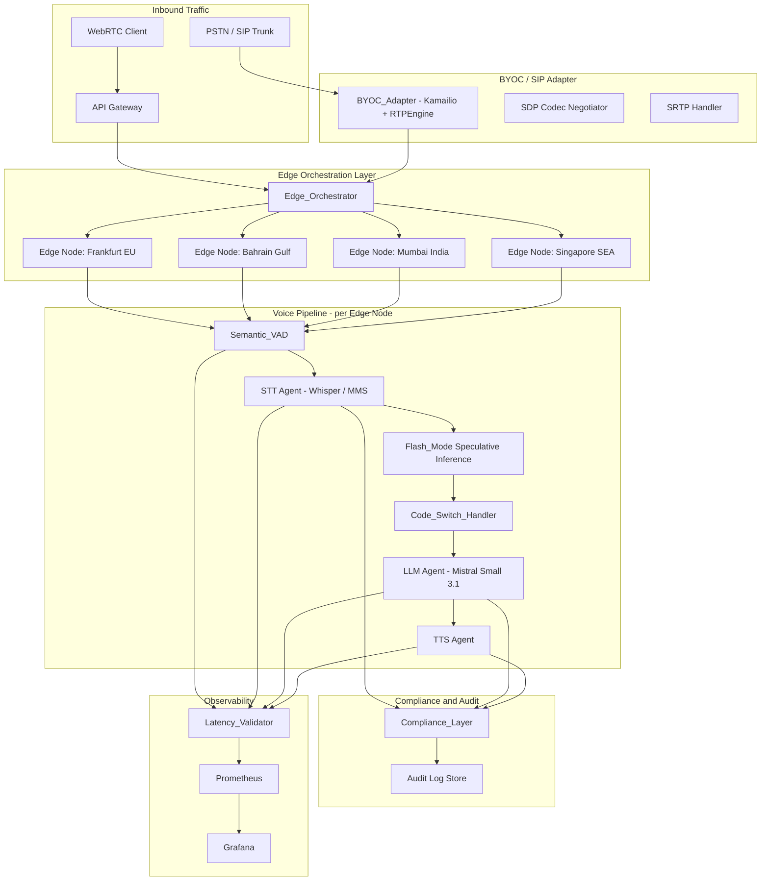
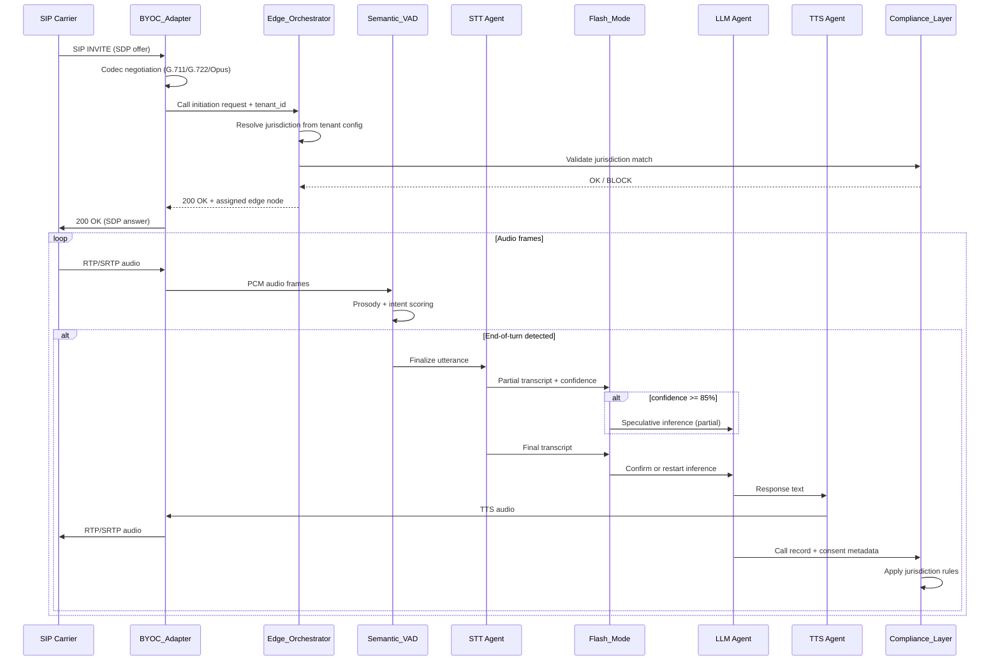

# Design Document: Voiquyr Differentiators

## Overview

This document covers the technical design for the eight Voiquyr-specific competitive differentiators
that sit on top of the `euvoice-ai-platform` base. These features are the hard technical moat that
justifies Voiquyr's premium UCPM pricing (€0.09–0.15/min EU, $0.09–0.14/min ME, ₹6–9/min India).

The design integrates with the existing euvoice-ai-platform components — STT agent, LLM agent,
TTS agent, and API gateway — adding new layers for edge orchestration, SIP/BYOC, semantic VAD,
speculative inference, code-switching, compliance, latency validation, and carrier feasibility.


## Architecture

### High-Level System Architecture



### Component Interaction — Call Flow




## Components and Interfaces

### 1. Edge_Orchestrator

Responsible for jurisdiction-aware call routing. Deployed as a stateless service in front of all
four edge nodes. Reads tenant jurisdiction config from a distributed config store (etcd or
Consul) with a 60-second TTL cache.

**Technology choice:** Go service with gRPC for low-latency routing decisions. etcd for config
storage (already used in Kubernetes control plane). Rationale: Go's goroutine model handles
thousands of concurrent routing decisions with sub-millisecond overhead; etcd watch API enables
near-real-time config propagation.

```python
# Edge_Orchestrator interface (Python representation for consistency with existing codebase)

@dataclass
class JurisdictionConfig:
    tenant_id: str
    jurisdiction: Literal["EU", "Gulf", "India", "SEA"]
    edge_node: Literal["frankfurt", "bahrain", "mumbai", "singapore"]
    updated_at: datetime

@dataclass
class CallRoutingDecision:
    call_id: str
    tenant_id: str
    edge_node: str
    jurisdiction: str
    decided_at: datetime
    audit_entry_id: str

@dataclass
class EdgeNodeStatus:
    node_id: str
    healthy: bool
    current_sessions: int
    last_heartbeat: datetime

class EdgeOrchestrator:
    async def route_call(self, tenant_id: str, call_id: str) -> CallRoutingDecision: ...
    async def get_node_status(self, node_id: str) -> EdgeNodeStatus: ...
    async def update_jurisdiction_config(self, config: JurisdictionConfig) -> None: ...
    async def get_audit_log(self, call_id: str) -> AuditLogEntry: ...
```

**Audit log entry schema (per-call, append-only):**

```json
{
  "call_id": "uuid",
  "tenant_id": "uuid",
  "edge_node": "frankfurt",
  "jurisdiction": "EU",
  "enforced_at": "2025-01-01T00:00:00Z",
  "pipeline_stages": ["stt", "llm", "tts"],
  "cross_border_events": []
}
```

---

### 2. BYOC_Adapter

Generic SIP/BYOC carrier adapter. Built on **Kamailio** (SIP proxy/registrar) + **RTPEngine**
(media relay with SRTP support). Kamailio handles RFC 3261 SIP signalling; RTPEngine handles
RTP/SRTP media bridging and codec transcoding.

**Technology choice:** Kamailio is the industry-standard open-source SIP proxy used by Twilio,
Vonage, and major telcos. It handles RFC 3261 natively including re-INVITE, UPDATE, and all
standard SIP methods. RTPEngine provides hardware-accelerated SRTP and codec transcoding.
Rationale: avoids reinventing SIP state machines; Kamailio's modular architecture means
carrier-specific quirks (unknown headers, non-standard timers) are handled by config, not code.

```python
@dataclass
class SIPTrunkConfig:
    trunk_id: str
    tenant_id: str
    host: str
    port: int
    username: str
    password: str  # stored encrypted
    codec_preferences: List[Literal["G711u", "G711a", "G722", "Opus"]]
    srtp_required: bool
    registered_at: Optional[datetime] = None

@dataclass
class SIPRegistrationResult:
    trunk_id: str
    success: bool
    error_type: Optional[Literal["auth", "network", "codec_mismatch"]] = None
    error_detail: Optional[str] = None
    registered_at: Optional[datetime] = None

@dataclass
class CodecNegotiationResult:
    offered_codecs: List[str]
    selected_codec: str
    srtp_negotiated: bool

class BYOCAdapter:
    async def register_trunk(self, config: SIPTrunkConfig) -> SIPRegistrationResult: ...
    async def negotiate_codecs(self, sdp_offer: str) -> CodecNegotiationResult: ...
    async def get_session_count(self, edge_node: str) -> int: ...
    async def handle_reinvite(self, call_id: str, new_sdp: str) -> str: ...  # returns SDP answer
```

**Self-service configuration API (REST):**

```
POST /api/v1/trunks          — register new SIP trunk
GET  /api/v1/trunks/{id}     — get trunk status
PUT  /api/v1/trunks/{id}     — update trunk config
DELETE /api/v1/trunks/{id}   — deregister trunk
GET  /api/v1/trunks/{id}/sessions — active session count
```

---

### 3. Semantic_VAD

End-of-turn detection using prosody + partial intent signals. Runs as a streaming processor
on each audio frame (20ms frames, 50Hz processing rate).

**Technology choice:** Prosody features extracted via **pyannote.audio** (pitch, energy, speaking
rate). Intent completeness scored using a lightweight **distilBERT** model fine-tuned on
conversational turn-taking data. Fallback to WebRTC VAD (energy-based) when the model is
unavailable. Rationale: pyannote.audio is the state-of-the-art for speaker diarization and
prosody; distilBERT is small enough (<70MB) to run on-edge with <10ms inference latency.

```python
@dataclass
class AudioFrame:
    data: np.ndarray       # 20ms PCM at 16kHz = 320 samples
    timestamp_ms: float
    call_id: str

@dataclass
class VADResult:
    frame_timestamp_ms: float
    is_speech: bool
    end_of_turn: bool
    suppressed: bool           # True if EOT suppressed due to incomplete intent
    prosody_score: float       # 0-1, higher = more likely complete
    intent_score: float        # 0-1, higher = more likely complete intent
    processing_latency_ms: float
    fallback_mode: bool        # True if using silence-only VAD

class SemanticVAD:
    async def process_frame(self, frame: AudioFrame) -> VADResult: ...
    async def reset_session(self, call_id: str) -> None: ...
    def is_model_available(self) -> bool: ...
```

**Prosody feature vector (per frame):**
- Fundamental frequency (F0) and F0 trajectory slope
- RMS energy and energy delta
- Speaking rate (syllables/sec, estimated from zero-crossing rate)
- Pause duration since last voiced frame

**Intent completeness signal:**
- Partial transcript fed to distilBERT classifier every 200ms
- Output: probability that the utterance is syntactically/semantically complete
- Threshold: 0.7 for EOT trigger, 0.3 for suppression

---

### 4. Flash_Mode (Speculative Inference)

Speculative LLM inference that begins at 85% STT confidence. Manages speculative/final
transcript reconciliation and hit-rate logging.

**Technology choice:** Implemented as a middleware layer between the STT agent and LLM agent.
Uses the existing `ConversationContext` from `llm_agent.py`. Speculative outputs are held in
a per-call buffer keyed by `(call_id, speculative_transcript_hash)`. Rationale: no new
inference infrastructure needed — Flash_Mode is a scheduling/caching layer on top of the
existing LLM agent.

```python
@dataclass
class SpeculativeInferenceState:
    call_id: str
    tenant_id: str
    speculative_transcript: str
    speculative_transcript_hash: str
    speculative_output: Optional[str]
    inference_started_at: float
    confidence_at_trigger: float
    status: Literal["pending", "complete", "discarded", "used"]

@dataclass
class FlashModeResult:
    call_id: str
    final_transcript: str
    llm_output: str
    was_speculative_hit: bool
    ttft_ms: float
    speculative_ttft_ms: Optional[float]

class FlashMode:
    async def on_partial_transcript(
        self, call_id: str, transcript: str, confidence: float
    ) -> None: ...

    async def on_final_transcript(
        self, call_id: str, final_transcript: str
    ) -> FlashModeResult: ...

    async def get_hit_rate(self, tenant_id: str, date: str) -> float: ...
    def is_enabled_for_tenant(self, tenant_id: str) -> bool: ...
```

**Reconciliation logic:**

```
on_final_transcript(call_id, final):
    state = get_speculative_state(call_id)
    if state is None:
        # No speculative inference was started (confidence never reached 85%)
        return await llm_agent.infer(final)
    if hash(final) == state.speculative_transcript_hash:
        # Hit: reuse speculative output
        state.status = "used"
        log_hit(tenant_id)
        return state.speculative_output
    else:
        # Miss: discard and restart
        state.status = "discarded"
        log_miss(tenant_id)
        return await llm_agent.infer(final)
```

---

### 5. Code_Switch_Handler

Word-boundary language switch detection and unified transcript production for
Arabic↔English and Hindi↔English.

**Technology choice:** **MMS (Meta Massively Multilingual Speech)** model for multilingual STT
with code-switching support. MMS natively handles Arabic, Hindi, and English in a single pass.
Language boundary detection uses a sliding-window CTC alignment score comparison between
language-specific acoustic models. Rationale: MMS is the only open-source model with
demonstrated <15% WER on Arabic↔English code-switching benchmarks; it avoids the latency
of running two separate STT passes.

```python
@dataclass
class LanguageSegment:
    language: Literal["ar", "hi", "en"]
    text: str
    start_word_idx: int
    end_word_idx: int
    confidence: float

@dataclass
class CodeSwitchTranscript:
    call_id: str
    unified_transcript: str
    segments: List[LanguageSegment]
    switch_count: int
    dominant_language: str
    language_mix_ratio: Dict[str, float]  # e.g. {"ar": 0.6, "en": 0.4}
    wer_estimate: Optional[float]

@dataclass
class ResponseLanguageConfig:
    tenant_id: str
    preferred_response_language: Optional[str]  # None = preserve mix ratio

class CodeSwitchHandler:
    async def transcribe(
        self, audio: np.ndarray, sample_rate: int, call_id: str
    ) -> CodeSwitchTranscript: ...

    async def prepare_llm_input(
        self, transcript: CodeSwitchTranscript
    ) -> str: ...

    async def apply_response_language(
        self, llm_output: str, config: ResponseLanguageConfig,
        input_mix_ratio: Dict[str, float]
    ) -> str: ...
```

**Language detection pipeline:**

```
1. Run MMS multilingual STT on full utterance → word-level CTC alignment
2. For each word, compare log-likelihood under ar/hi/en acoustic models
3. Assign language label to each word (argmax of per-language scores)
4. Merge consecutive same-language words into segments
5. Produce unified transcript preserving original word order
```


---

### 6. Compliance_Layer

Per-jurisdiction data handling enforcement. Runs as a sidecar to the call pipeline on each
edge node. Applies jurisdiction-specific rule sets and generates per-call compliance records.

**Technology choice:** Python service with a rule engine pattern. Each jurisdiction's rules
are implemented as a `ComplianceRuleSet` class. Records stored in PostgreSQL (already in the
platform stack) w
ith row-level security per jurisdiction. Erasure requests handled via a
scheduled deletion job with a per-jurisdiction SLA timer (GDPR: 30 days, PDPL: 30 days,
DPDP: 7 days for data principals).

```python
@dataclass
class ComplianceRecord:
    record_id: str
    call_id: str
    tenant_id: str
    jurisdiction: Literal["EU", "Gulf", "India", "SEA"]
    rule_set_applied: str          # e.g. "GDPR_2018", "UAE_PDPL_2021", "INDIA_DPDP_2023"
    lawful_basis: Optional[str]    # e.g. "consent", "legitimate_interest", "contract"
    consent_status: Optional[bool]
    data_retention_days: int
    created_at: datetime
    scheduled_deletion_at: Optional[datetime]

@dataclass
class ErasureRequest:
    request_id: str
    data_subject_id: str
    jurisdiction: str
    submitted_at: datetime
    sla_deadline: datetime
    status: Literal["pending", "scheduled", "completed"]
    affected_call_ids: List[str]

class ComplianceLayer:
    async def process_call(
        self, call_id: str, tenant_id: str, jurisdiction: str, metadata: Dict
    ) -> ComplianceRecord: ...

    async def validate_jurisdiction_match(
        self, call_jurisdiction: str, tenant_compliance_jurisdiction: str
    ) -> bool: ...

    async def handle_erasure_request(
        self, data_subject_id: str, jurisdiction: str
    ) -> ErasureRequest: ...

    async def generate_monthly_report(
        self, jurisdiction: str, year: int, month: int
    ) -> ComplianceSummaryReport: ...
```

**Jurisdiction rule sets:**

| Jurisdiction | Rule Set | Key Requirements |
|---|---|---|
| Frankfurt (EU) | GDPR_2018 | Lawful basis recording, data minimisation, right-to-erasure (30 days), DPA notification |
| Bahrain (Gulf) | UAE_PDPL_2021 | Consent recording, data localisation, cross-border transfer restriction, 30-day erasure |
| Mumbai (India) | INDIA_DPDP_2023 | Consent notice, data fiduciary obligations, data principal rights, 7-day erasure |
| Singapore (SEA) | PDPA_2012 | Consent, purpose limitation, data portability |

---

### 7. Latency_Validator

Automated benchmarking service that continuously measures p95 conversational latency per
region using synthetic test calls.

**Technology choice:** Python service using **Prometheus** for metrics storage (already in
the platform stack) and **Grafana** for dashboards. Synthetic calls generated by a test
harness that replays a fixed set of 50 utterances per region every 5 minutes. Latency
decomposition uses OpenTelemetry spans already instrumented in the STT/LLM/TTS agents.
Rationale: reuses existing observability infrastructure; 90-day retention handled by
Prometheus remote write to a long-term store (Thanos or VictoriaMetrics).

```python
@dataclass
class LatencyMeasurement:
    measurement_id: str
    region: Literal["frankfurt", "bahrain", "mumbai", "singapore"]
    timestamp: datetime
    total_latency_ms: float
    stt_latency_ms: float
    llm_ttft_ms: float
    llm_generation_ms: float
    tts_first_byte_ms: float
    is_synthetic: bool

@dataclass
class RegionLatencyReport:
    region: str
    window_start: datetime
    window_end: datetime
    p50_ms: float
    p95_ms: float
    p99_ms: float
    sample_count: int
    sla_breach: bool  # True if p95 > 500ms

@dataclass
class DeploymentGateResult:
    edge_node: str
    deployment_id: str
    p95_ms: float
    gate_passed: bool
    measured_at: datetime

class LatencyValidator:
    async def run_synthetic_suite(self, region: str) -> List[LatencyMeasurement]: ...
    async def get_region_report(self, region: str) -> RegionLatencyReport: ...
    async def check_sla_breach(self, region: str) -> bool: ...
    async def run_deployment_gate(
        self, edge_node: str, deployment_id: str
    ) -> DeploymentGateResult: ...
    async def get_dashboard_data(self) -> Dict[str, RegionLatencyReport]: ...
```

**Latency decomposition using OpenTelemetry spans:**

```
call_start (EO routing decision)
  └── stt_span (audio_received → transcript_ready)
  └── llm_ttft_span (transcript_ready → first_token)
  └── llm_generation_span (first_token → last_token)
  └── tts_span (last_token → first_audio_byte)
total = stt + llm_ttft + llm_generation + tts
```

---

### 8. BYOC Carrier Feasibility Spike

Engineering spike to validate the generic BYOC_Adapter against Tata Communications and Jio
SIP trunks. This is a time-boxed investigation (2-week spike), not a production component.

**Spike methodology:**
1. Provision test SIP trunks from Tata Communications and Jio in a staging environment
2. Register each trunk via the self-service configuration API (no custom code)
3. Place test calls, record SIP traces (SIPp + Wireshark), and measure codec negotiation
4. Document any RFC 3261 deviations (non-standard headers, timer values, re-INVITE behaviour)
5. Produce feasibility report with go/no-go recommendation

**Feasibility report structure:**
- SIP stack compatibility matrix (Kamailio version vs carrier SIP stack)
- RFC 3261 deviation log (header, observed value, expected value, impact)
- Codec negotiation results (offered codecs, selected codec, transcoding required)
- Non-standard header inventory (headers to be silently ignored)
- Go/no-go recommendation with rationale
- If workarounds required: scope, generalisability, and implementation estimate


## Data Models

### Call Lifecycle State

```python
@dataclass
class CallState:
    call_id: str
    tenant_id: str
    jurisdiction: str
    edge_node: str
    sip_trunk_id: Optional[str]
    codec: str
    srtp_enabled: bool
    language_pair: Optional[str]       # e.g. "ar-en", "hi-en", None for monolingual
    flash_mode_enabled: bool
    compliance_record_id: str
    started_at: datetime
    ended_at: Optional[datetime]
    status: Literal["routing", "active", "ended", "rejected"]
```

### Tenant Configuration

```python
@dataclass
class TenantConfig:
    tenant_id: str
    jurisdiction: Literal["EU", "Gulf", "India", "SEA"]
    compliance_jurisdiction: str
    flash_mode_enabled: bool           # default True
    preferred_response_language: Optional[str]
    sip_trunks: List[str]              # trunk_ids
    updated_at: datetime
```

### Audit Log Entry

```python
@dataclass
class AuditLogEntry:
    entry_id: str
    call_id: str
    tenant_id: str
    edge_node: str
    jurisdiction: str
    enforced_at: datetime
    pipeline_stages_in_jurisdiction: List[str]
    cross_border_events: List[str]     # must be empty for compliant calls
    compliance_record_id: str
```

### Latency Metric (Prometheus labels)

```
voiquyr_call_latency_ms{region, component, percentile, synthetic}
voiquyr_flash_mode_hit_rate{tenant_id, date}
voiquyr_vad_false_interruption_rate{region, date}
voiquyr_code_switch_wer{language_pair, date}
voiquyr_sip_sessions_active{edge_node}
```


## Correctness Properties

*A property is a characteristic or behavior that should hold true across all valid executions
of a system — essentially, a formal statement about what the system should do. Properties serve
as the bridge between human-readable specifications and machine-verifiable correctness guarantees.*

---

### Property 1: Jurisdiction routing invariant

*For any* call initiated by any tenant, the edge node assigned by the Edge_Orchestrator must
match the jurisdiction configured for that tenant — Frankfurt for EU, Bahrain for Gulf,
Mumbai for India, Singapore for SEA — and all data events (audio, transcript, metadata,
STT/LLM/TTS pipeline stages) associated with that call must be tagged with the same
jurisdictional boundary.

**Validates: Requirements 1.1, 1.3, 1.6**

---

### Property 2: Audit log completeness

*For any* call processed by the Edge_Orchestrator, the audit log must contain an entry with
the call_id, the assigned edge node, the jurisdiction enforced, and the enforcement timestamp.
No call may complete without a corresponding audit entry.

**Validates: Requirements 1.5**

---

### Property 3: SIP codec negotiation correctness

*For any* SDP offer containing any non-empty subset of {G711u, G711a, G722, Opus}, the
BYOC_Adapter's SDP answer must select exactly one codec that appears in both the offer and
the adapter's supported codec list. If the offer contains no supported codecs, the adapter
must reject the call with a 488 Not Acceptable Here response.

**Validates: Requirements 2.3**

---

### Property 4: SRTP negotiation invariant

*For any* SIP trunk whose SDP offer advertises SRTP capability, the BYOC_Adapter must
negotiate SRTP for the media session. For any trunk whose SDP offer does not advertise SRTP,
the adapter must not unilaterally upgrade to SRTP.

**Validates: Requirements 2.4**

---

### Property 5: SIP trunk registration error classification

*For any* failed SIP trunk registration, the error response must classify the failure as
exactly one of: authentication failure, network reachability failure, or codec mismatch.
No registration failure may return an unclassified error.

**Validates: Requirements 2.7**

---

### Property 6: Semantic VAD processing latency

*For any* 20ms audio frame submitted to the Semantic_VAD, the processing latency (time from
frame receipt to VADResult emission) must be less than 50ms, regardless of the prosody or
intent content of the frame.

**Validates: Requirements 3.5**

---

### Property 7: VAD end-of-turn suppression window

*For any* audio segment where the intent completeness score is below the suppression threshold
(0.3) and a pause is detected, the Semantic_VAD must not emit an end-of-turn signal for at
least 2,000ms from the start of the pause.

**Validates: Requirements 3.2**

---

### Property 8: Flash_Mode speculative hit reuse

*For any* call where the final STT transcript is identical to the speculative transcript
(same string after normalisation), the Flash_Mode must return the already-computed LLM output
without initiating a new inference request to the LLM agent.

**Validates: Requirements 4.3**

---

### Property 9: Flash_Mode speculative miss discard

*For any* call where the final STT transcript differs from the speculative transcript, the
Flash_Mode must discard the speculative LLM output and produce the final response exclusively
from inference on the final transcript.

**Validates: Requirements 4.2**

---

### Property 10: Flash_Mode trigger threshold

*For any* partial STT result with a confidence score >= 0.85, the Flash_Mode must initiate
speculative LLM inference. For any partial STT result with confidence < 0.85, the Flash_Mode
must not initiate speculative inference.

**Validates: Requirements 4.1, 4.5**

---

### Property 11: Flash_Mode hit rate logging

*For any* set of N calls processed for a tenant on a given day, the logged hit rate must
equal (number of calls where speculative output was used) / N, accurate to within 0.1%.

**Validates: Requirements 4.7**

---

### Property 12: Code-switch detection coverage

*For any* utterance containing at least one word-boundary language switch between Arabic and
English, or Hindi and English, the Code_Switch_Handler must produce a CodeSwitchTranscript
with switch_count >= 1 and segments covering all words in the utterance with no gaps.

**Validates: Requirements 5.1, 5.5**

---

### Property 13: Unified transcript completeness

*For any* mixed-language utterance processed by the Code_Switch_Handler, the unified_transcript
field must contain all words from all language segments in their original order, with no words
dropped at segment boundaries.

**Validates: Requirements 5.3**

---

### Property 14: Preferred response language enforcement

*For any* call where the tenant has configured a preferred_response_language, the text passed
to the TTS agent must be in the configured language, regardless of the language mix ratio of
the input utterance.

**Validates: Requirements 5.7**

---

### Property 15: Jurisdiction-to-rule-set mapping

*For any* call processed by the Compliance_Layer, the rule_set_applied field in the compliance
record must correspond exactly to the jurisdiction of the call's edge node: GDPR_2018 for
Frankfurt, UAE_PDPL_2021 for Bahrain, INDIA_DPDP_2023 for Mumbai, PDPA_2012 for Singapore.
No call may have a compliance record with a mismatched rule set.

**Validates: Requirements 6.1, 6.2, 6.3, 6.4**

---

### Property 16: Compliance record completeness

*For any* call processed by the Compliance_Layer, the compliance record must contain:
call_id, tenant_id, jurisdiction, rule_set_applied, lawful_basis or consent_status,
data_retention_days, and created_at. No field may be null except where the rule set
explicitly permits it.

**Validates: Requirements 6.5**

---

### Property 17: Erasure request completeness

*For any* data erasure request, after the request is processed, querying the system for any
call record, transcript, or metadata associated with the data subject must return no results.

**Validates: Requirements 6.6**

---

### Property 18: Latency decomposition sum invariant

*For any* latency measurement produced by the Latency_Validator, the sum of
stt_latency_ms + llm_ttft_ms + llm_generation_ms + tts_first_byte_ms must equal
total_latency_ms within a tolerance of 1ms (accounting for inter-component network overhead).

**Validates: Requirements 7.4**

---

### Property 19: SLA breach alert generation

*For any* regional latency measurement where p95_ms > 500, the Latency_Validator must
generate an alert within 60 seconds of the measurement being recorded.

**Validates: Requirements 7.3**

---

### Property 20: Deployment gate enforcement

*For any* deployment event where the pre-traffic validation suite measures p95_ms > 500 for
the target edge node, the Latency_Validator must return a DeploymentGateResult with
gate_passed = False, blocking traffic promotion.

**Validates: Requirements 7.8**


## Error Handling

### Edge_Orchestrator

- **Node unavailable:** Return `503 EdgeNodeUnavailable` with `{"error": "edge_node_unavailable", "jurisdiction": "EU", "node": "frankfurt"}`. Never reroute to a different jurisdiction. Log the rejection in the audit store.
- **Config store unreachable:** Serve from local cache (max 60s stale). If cache is also stale, reject all new calls with `503 ConfigUnavailable` until config store recovers.
- **Jurisdiction mismatch (compliance check fails):** Return `403 JurisdictionMismatch`. Generate a compliance alert. Do not initiate the call.

### BYOC_Adapter

- **SIP registration failure:** Return structured `SIPRegistrationResult` with `error_type` set to `auth`, `network`, or `codec_mismatch`. Log the failure with trunk_id and timestamp.
- **re-INVITE handling failure:** Send `500 Server Internal Error` SIP response. Do not drop the existing call leg. Log the re-INVITE SDP for debugging.
- **Codec negotiation failure (no common codec):** Send `488 Not Acceptable Here`. Log the offered codecs and the adapter's supported list.
- **Session limit reached (500 concurrent):** Send `503 Service Unavailable` with `Retry-After: 30`. Do not accept new sessions until capacity is available.

### Semantic_VAD

- **Model unavailable:** Fall back to energy-based VAD (WebRTC VAD). Log `{"event": "vad_fallback", "call_id": ..., "reason": "model_unavailable"}`. Continue processing without interruption.
- **Processing latency > 50ms:** Log a latency violation metric. Do not block the audio pipeline — emit the VAD result late rather than dropping the frame.

### Flash_Mode

- **LLM agent unavailable during speculative inference:** Mark speculative state as `discarded`. When the final transcript arrives, retry inference. Do not surface the LLM unavailability to the caller until the final transcript inference also fails.
- **Speculative inference still in-flight when final transcript arrives:** If final matches speculative, wait for speculative to complete (up to 200ms grace period). If final differs, cancel speculative and start fresh.

### Code_Switch_Handler

- **MMS model unavailable:** Fall back to single-language STT using the dominant language of the tenant's configured language pair. Log the fallback. Produce a transcript with a single segment and `switch_count = 0`.
- **Language detection confidence below threshold:** Treat the entire utterance as the dominant language. Do not produce partial segments with low-confidence language labels.

### Compliance_Layer

- **Jurisdiction mismatch detected:** Block the call. Generate `ComplianceAlert` with severity `CRITICAL`. Do not create a compliance record for the blocked call.
- **Database unavailable:** Queue compliance records in-memory (max 1,000 records). Flush to database when connectivity is restored. If queue overflows, reject new calls with `503 ComplianceStoreUnavailable`.
- **Erasure request processing failure:** Retry up to 3 times with exponential backoff. If all retries fail, escalate to a human operator queue and log the failure.

### Latency_Validator

- **Synthetic call failure:** Log the failure, skip the measurement, and retry at the next interval. Do not count failed synthetic calls in the p95 calculation.
- **Alert delivery failure:** Retry alert delivery up to 5 times. Log the alert locally even if delivery fails, so it can be recovered.
- **Deployment gate timeout (validation suite takes > 10 minutes):** Fail the gate with `gate_passed = False` and reason `"validation_timeout"`. Do not promote traffic.


## Testing Strategy

### Dual Testing Approach

Both unit tests and property-based tests are required. Unit tests cover specific examples,
integration points, and error conditions. Property-based tests verify universal correctness
across all valid inputs.

### Property-Based Testing

**Library:** `hypothesis` (Python) — the standard PBT library for the existing Python codebase.

Each property-based test must:
- Run a minimum of 100 iterations (configured via `@settings(max_examples=100)`)
- Be tagged with a comment referencing the design property it validates
- Use `hypothesis.strategies` to generate valid random inputs

**Tag format:** `# Feature: voiquyr-differentiators, Property {N}: {property_text}`

**Example property test structure:**

```python
from hypothesis import given, settings, strategies as st

# Feature: voiquyr-differentiators, Property 1: Jurisdiction routing invariant
@given(
    tenant_id=st.uuids(),
    jurisdiction=st.sampled_from(["EU", "Gulf", "India", "SEA"])
)
@settings(max_examples=100)
async def test_jurisdiction_routing_invariant(tenant_id, jurisdiction):
    config = TenantConfig(tenant_id=str(tenant_id), jurisdiction=jurisdiction, ...)
    decision = await orchestrator.route_call(str(tenant_id), call_id=str(uuid4()))
    expected_node = JURISDICTION_TO_NODE[jurisdiction]
    assert decision.edge_node == expected_node
    assert decision.jurisdiction == jurisdiction
```

**Property test coverage map:**

| Property | Test file | Strategy |
|---|---|---|
| P1: Jurisdiction routing | `test_edge_orchestrator.py` | Random tenant configs × jurisdictions |
| P2: Audit log completeness | `test_edge_orchestrator.py` | Random calls |
| P3: SDP codec negotiation | `test_byoc_adapter.py` | Random subsets of codec list |
| P4: SRTP negotiation | `test_byoc_adapter.py` | SDP offers with/without SRTP |
| P5: Error classification | `test_byoc_adapter.py` | Simulated failure scenarios |
| P6: VAD latency | `test_semantic_vad.py` | Random 20ms audio frames |
| P7: VAD suppression window | `test_semantic_vad.py` | Incomplete intent audio segments |
| P8: Flash hit reuse | `test_flash_mode.py` | Matching transcript pairs |
| P9: Flash miss discard | `test_flash_mode.py` | Differing transcript pairs |
| P10: Flash trigger threshold | `test_flash_mode.py` | Random confidence scores |
| P11: Hit rate logging | `test_flash_mode.py` | Random call sequences |
| P12: Code-switch detection | `test_code_switch.py` | Synthetic mixed-language utterances |
| P13: Transcript completeness | `test_code_switch.py` | Random word sequences with switches |
| P14: Preferred language | `test_code_switch.py` | Tenant configs × language pairs |
| P15: Jurisdiction-rule mapping | `test_compliance_layer.py` | Random calls × jurisdictions |
| P16: Compliance record fields | `test_compliance_layer.py` | Random call metadata |
| P17: Erasure completeness | `test_compliance_layer.py` | Random data subject IDs |
| P18: Latency decomposition sum | `test_latency_validator.py` | Random latency component values |
| P19: SLA breach alert | `test_latency_validator.py` | Measurements above/below 500ms |
| P20: Deployment gate | `test_latency_validator.py` | Synthetic deployment events |

### Unit Tests

Unit tests focus on:
- **Specific examples:** Known SIP traces from Tata/Jio (Req 8), known code-switch benchmark utterances (Req 5.8), known latency profiles
- **Integration points:** Edge_Orchestrator → Compliance_Layer jurisdiction mismatch flow; Flash_Mode → LLM agent interface; Code_Switch_Handler → TTS agent language handoff
- **Error conditions:** Node unavailable rejection (Req 1.4), re-INVITE handling (Req 2.5), VAD fallback (Req 3.7), compliance jurisdiction mismatch block (Req 6.7)
- **Benchmark examples:** VAD false interruption rate < 5% on test corpus (Req 3.4), code-switch WER < 15% on benchmark corpus (Req 5.8), Flash_Mode TTFT reduction >= 80ms (Req 4.4)

### Integration Tests

- End-to-end call flow per region using synthetic SIP calls (SIPp test harness)
- Compliance record generation verified against each jurisdiction's rule set
- Latency decomposition validated against OpenTelemetry span data
- Flash_Mode hit rate measured over 1,000 synthetic utterances

### Performance Tests

- BYOC_Adapter: 500 concurrent SIP sessions per edge node (Req 2.8) — load test with SIPp
- Semantic_VAD: 50Hz frame processing rate sustained over 30-minute call (Req 3.5)
- Latency_Validator: p95 < 500ms per region validated in staging before each production deployment (Req 7.8)
